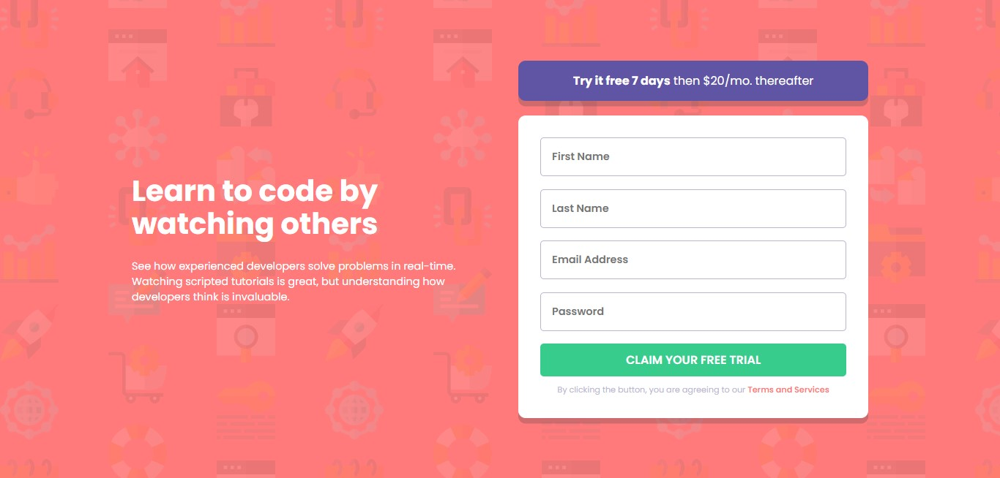

# Frontend Mentor - Intro component with sign up form solution

### O Desafio
O desafio proposto é desenvolver o projeto da forma mais leal ao design original, incluindo as funcionalidades.

- Layout Responsivo, independente do tamanho do dispositivo;
- Campos dinâmicos de acordo com seus status;
- Validação dos campos:
  - Um campo vazio deve retornar um erro: "[Nome do campo] não pode estar vazio";
  - Um endereço de email não formatado deve retornar um erro: "Parece que isso não é um email".

### Design

### Desenvolvimento

- HTML 5
- CSS (SCSS)
- JavaScript